# SAP-1 Microprocessor Project — Logisim Implementation

<p align="center">

  

  

</p>

## Table of Contents

Click on the "Table of Contents" below to navigate directly to the sections:

- [Project Overview](#overview)
- [Features](#features)
- [Video Tutorials](#video-tutorials)
- [Final Circuits](#final-circuits)
- [Architecture Components](#architecture-components)
- [Control Unit (Hardwired)](#control-unit)
- [Instruction Set & Example](#example-program)
- [Assembler or Compiler](#compiler)
- [Fetch–Decode–Execute Cycle](#fde)
- [Run the CPU — Auto Mode](#run-auto)
- [Run the CPU — Manual Mode](#run-manual)
- [Future Improvements](#roadmap)

---

<a id="overview"></a>

## Project Overview

This repository contains the Logisim implementation of a Simple-As-Possible (SAP-1) microprocessor, developed as part of a Control Sequencer assignment. The SAP-1 is a foundational 8-bit CPU architecture designed to teach the principles of computer design, inspired by educational resources like Ben Eater’s tutorials. This enhanced version includes a fully functional hardwired control unit that automates the fetch-decode-execute cycle. A key innovation is the ROM-based bootloader, which automatically loads machine code into RAM, removing the need for manual data entry. The project successfully executes a simple addition program, loading two 8-bit values, adding them, and storing the sum, with an added `JMP` instruction for branching.

---

<a id="features"></a>

## Features

- **Memory Loading:** Supports `LDA` and `LDB` instructions to load values into registers.
- **Arithmetic Operations:** Performs addition (`ADD`) and subtraction (`SUB`) between registers.
- **Data Storage:** Stores Register A contents into memory using the `STA` instruction.
- **Control Flow:** Includes a `JMP` instruction for loops and branching.
- **Program Execution:** Executes instructions sequentially using the Program Counter.
- **Instruction Processing:** Automatically fetches, decodes, and executes via the Instruction Register and Control Logic.
- **Halt Execution:** Stops with the `HLT` instruction.
- **Debugging Support:** Enables step-by-step manual control with dedicated pins in Logisim.
- **Memory Capacity:** Manages 16 memory addresses (4-bit address space).
- **Data Processing:** Handles 8-bit data for arithmetic and storage.
- **ROM Storage:** Stores instruction code in ROM for persistent programs.
- **Bootloader:** Loads ROM data into RAM automatically or manually for testing.

---

<a id="video-tutorials"></a>

## Video Tutorials

Video demonstrations are available to guide you through the SAP-1 CPU simulation:

- Manual Mode (`sap1_manual.circ`): [Watch Here](https://youtu.be/PrJcHA_dC8Q)
- Auto Mode (`sap1_auto.circ`): [Watch Here](https://youtu.be/vwInhCTQctg)

---

<a id="final-circuits"></a>

## Final Circuits

- **Manual Mode (`sap1_manual_avishek.circ`)**

  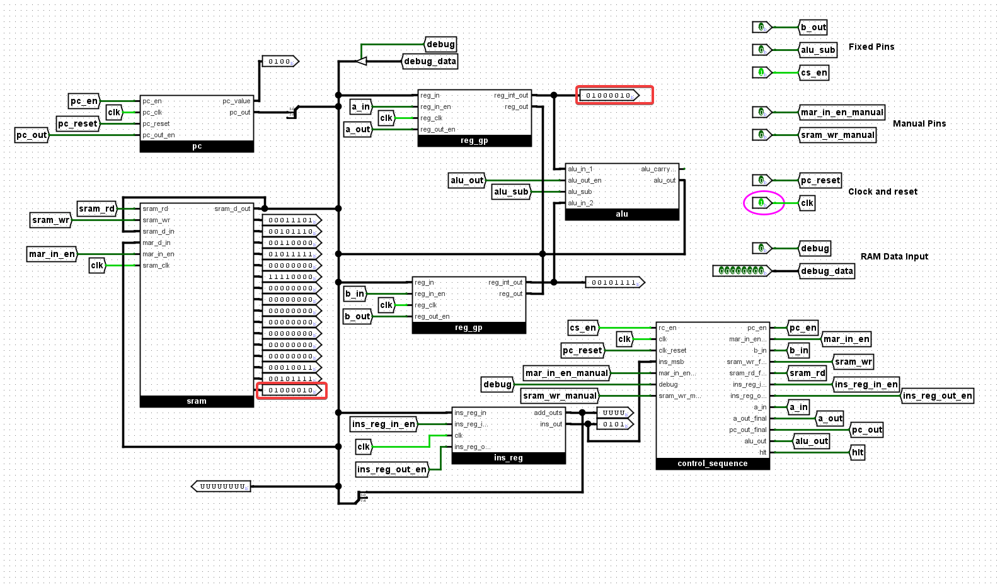

- **Auto Mode (`sap1_auto_avishek.circ`)**

  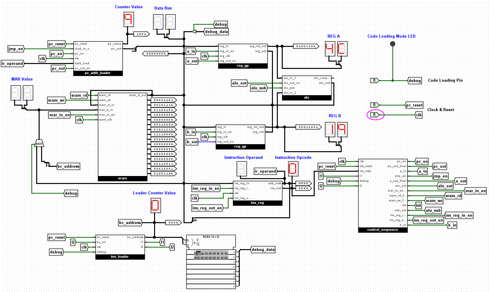

---

<a id="architecture-components"></a>

## Architecture Components

The SAP-1 CPU consists of the following key building blocks:

- **Program Counter (PC):** A 4-bit counter storing the next instruction’s memory address, incrementing after each fetch.

  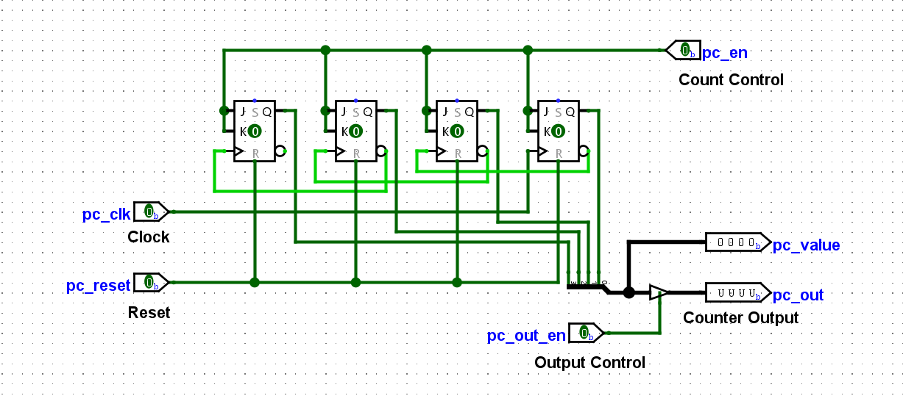

- **Random Access Memory (RAM):** An 8-bit wide, 16-byte RAM for instructions and data.

  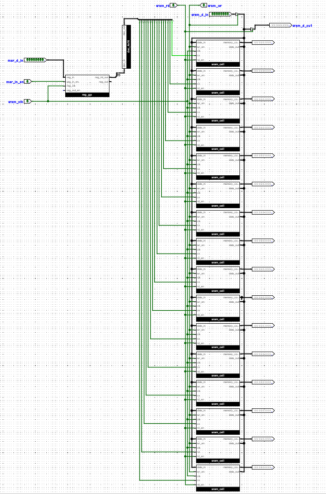

- **Memory Address Register (MAR):** A 4-bit register holding the current memory address for access.

- **Instruction Register (IR):** An 8-bit register holding the fetched instruction (4-bit opcode, 4-bit operand).

  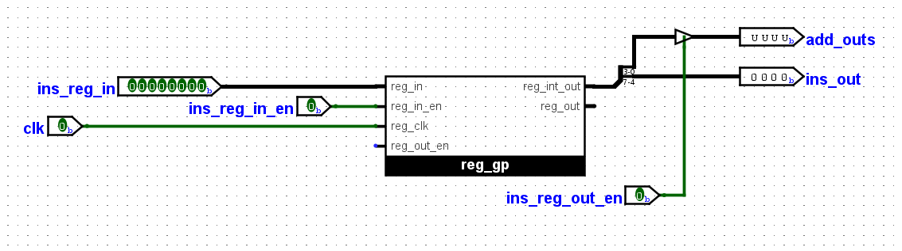

- **Registers A & B:** 8-bit registers; A (Accumulator) for results, B for operands.

  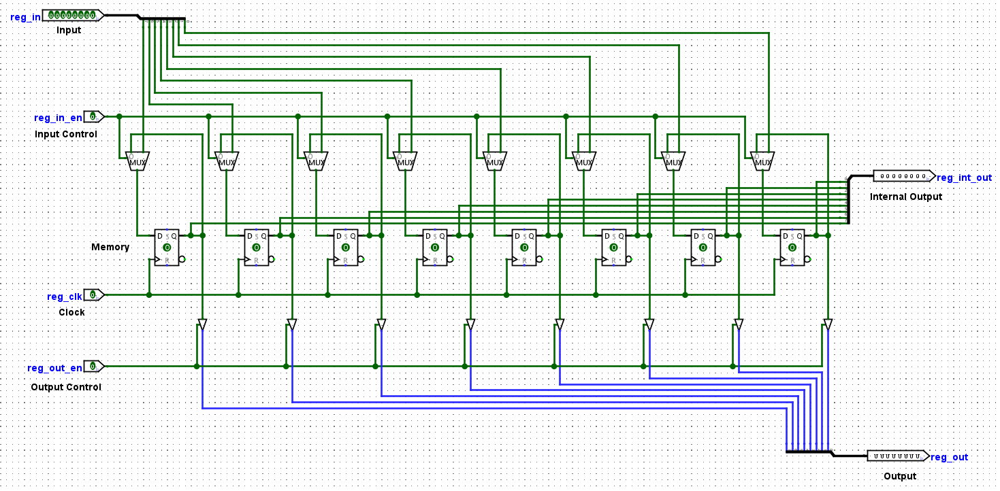

- **Arithmetic Logic Unit (ALU):** An 8-bit unit for addition and subtraction.

  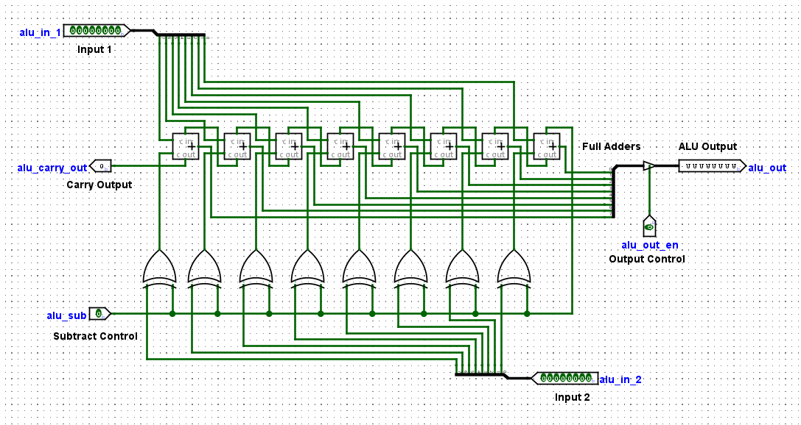

- **Instruction Loader:** Transfers ROM code to RAM with clock pulses.

  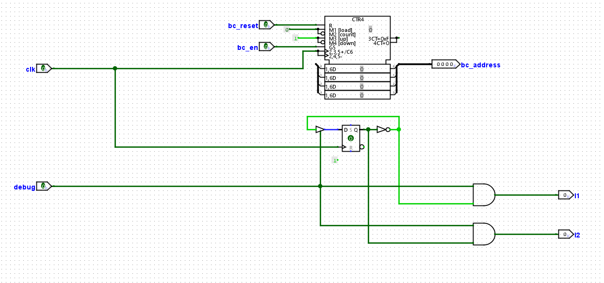

- **Output Register:** Displays results (implicitly via A or direct output).

- **Control Unit:** Generates control signals to sequence operations.

  - **Control Unit — Auto Mode (Overview)**

    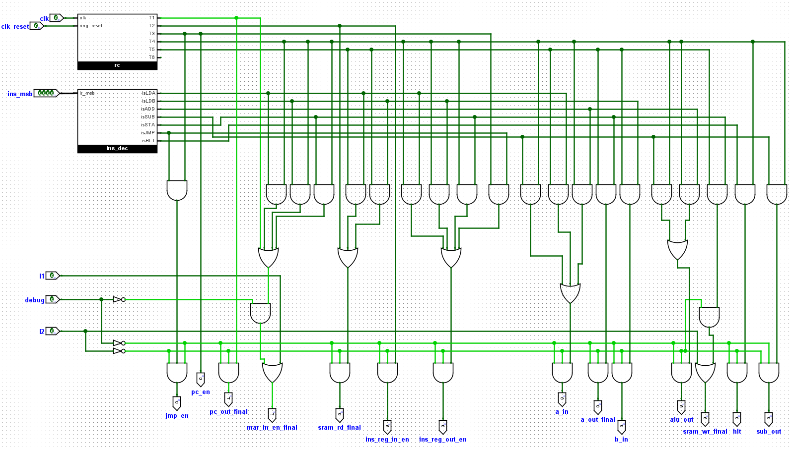

  - **Control Unit — Auto Mode (Detail)**

    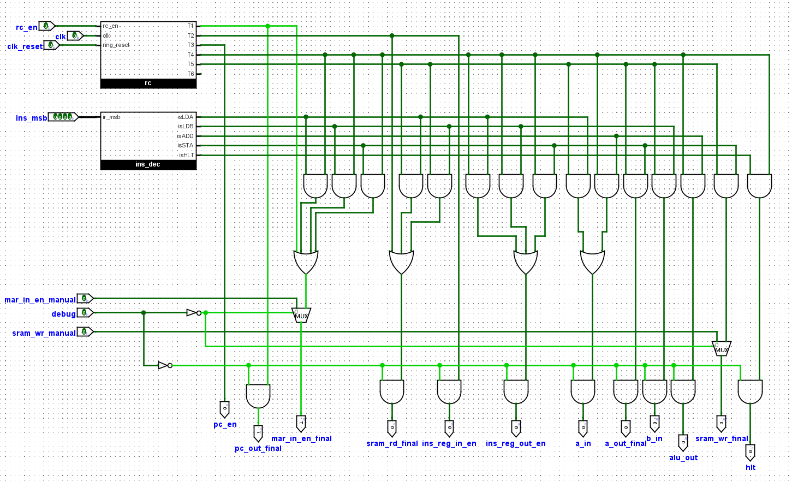

---

<a id="control-unit"></a>

## Control Unit (Hardwired)

The control unit uses combinational logic (AND, OR, NOT gates) and a state counter to manage CPU operations.

<a id="subcomponents"></a>

### Subcomponents

- **State Counter (RC):** A 3-bit counter cycling through T-states (T1 to T6).

  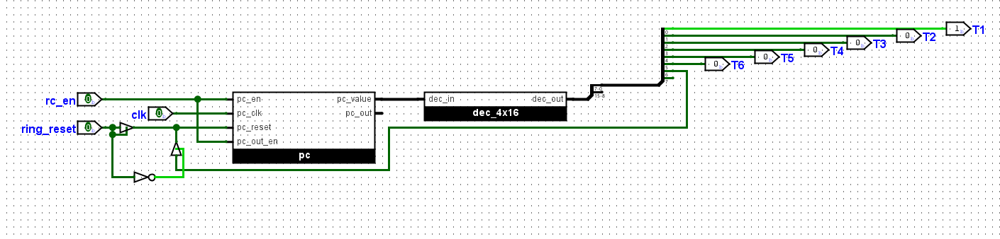

- **Opcode Decoder:** A 4-to-16 decoder processing the IR’s 4-bit opcode to activate instructions (e.g., `isLDA`, `isJMP`).

  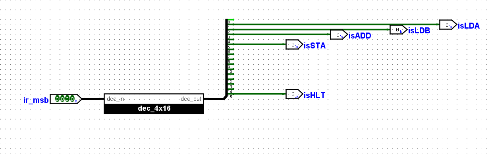

- **Control Matrix:** AND/OR gates combining T-states and decoded instructions to generate control signals.

<a id="control-auto"></a>

### Control Signals — Auto Mode (`sap1_auto_avishek.circ`)

Boolean equations for control pins (implemented with gates, active when `cpu_mode` is HIGH, i.e., `debug` is LOW):

- `pc_out_final = T1 AND cpu_mode AND (NOT l2)`
- `mar_in_en_final = (T1 AND cpu_mode) OR ((T4 AND isLDA) AND cpu_mode) OR ((T4 AND isLDB) AND cpu_mode) OR ((T4 AND isSTA) AND cpu_mode) OR (l2 AND debug)`
- `sram_rd_final = (T2 AND cpu_mode) OR ((T5 AND isLDA) AND cpu_mode) OR ((T5 AND isLDB) AND cpu_mode AND (NOT l2))`
- `ins_reg_in_en_final = T2 AND cpu_mode AND (NOT l2)`
- `pc_en_final = T3 AND cpu_mode AND (NOT l2)`
- `ins_reg_out_en_final = ((T4 AND isLDA) AND cpu_mode) OR ((T4 AND isLDB) AND cpu_mode) OR ((T4 AND isSTA) AND cpu_mode) OR (T3 AND isJMP)`
- `a_in_final = ((T5 AND isLDA) AND cpu_mode) OR ((T4 AND isADD) AND cpu_mode AND (NOT l2))`
- `a_out_final = ((T4 AND isADD) AND cpu_mode) OR ((T5 AND isSTA) AND cpu_mode AND (NOT l2))`
- `b_in_final = (T5 AND isLDB) AND cpu_mode AND (NOT l2)`
- `b_out_final = (T4 AND isADD) AND cpu_mode AND (NOT l2)`
- `alu_out_final = (T4 AND isADD) AND cpu_mode AND (NOT l2)`
- `sram_wr_final = ((T5 AND isSTA) AND (NOT l2)) OR (l2 AND debug)`
- `alu_sub = (T4 AND isSUB) AND cpu_mode AND (NOT l2)`
- `hlt = T4 AND isHLT AND (NOT l2)` _(Stops clock/state counter)_
- `jmp_en = (T3 AND isJMP) AND cpu_mode AND (NOT l2)`

<a id="control-manual"></a>

### Control Signals — Manual Mode (`sap1_manual_avishek.circ`)

- `pc_out_final = T1 AND cpu_mode`
- `mar_in_en_final = (T1 AND cpu_mode) OR ((T4 AND isLDA) AND cpu_mode) OR ((T4 AND isLDB) AND cpu_mode) OR ((T4 AND isSTA) AND cpu_mode) OR (mar_in_en_manual AND NOT cpu_mode)`
- `sram_rd_final = (T2 AND cpu_mode) OR ((T5 AND isLDA) AND cpu_mode) OR ((T5 AND isLDB) AND cpu_mode)`
- `ins_reg_in_en_final = T2 AND cpu_mode`
- `pc_en_final = T3 AND cpu_mode`
- `ins_reg_out_en_final = ((T4 AND isLDA) AND cpu_mode) OR ((T4 AND isLDB) AND cpu_mode) OR ((T4 AND isSTA) AND cpu_mode)`
- `a_in_final = ((T5 AND isLDA) AND cpu_mode) OR ((T4 AND isADD) AND cpu_mode)`
- `a_out_final = ((T4 AND isADD) AND cpu_mode) OR ((T5 AND isSTA) AND cpu_mode)`
- `b_in_final = (T5 AND isLDB) AND cpu_mode`
- `b_out_final = (T4 AND isADD) AND cpu_mode`
- `alu_out_final = (T4 AND isADD) AND cpu_mode`
- `sram_wr_final = (T5 AND isSTA) AND cpu_mode OR (sram_wr_manual AND NOT cpu_mode)`
- `alu_sub = (T4 AND isSUB) AND cpu_mode`
- `hlt = T4 AND isHLT`

**Note on Debug Mode:** When `debug` is HIGH, `cpu_mode` is LOW, disabling auto signals. `mar_in_en_final` and `sram_wr_final` use manual inputs for RAM programming.

---

<a id="example-program"></a>

## Machine Code Program: Addition with JMP

This program loads two 8-bit values 19(Avishek's student id) and 47(Avishek's friend's student id), adds them, stores the sum (66), and loops with JMP.

### Memory Addresses

- Value 1 (Dec 19 & Hex `13`) at: `00001101` (Decimal 13)
- Value 2 (Dec 47 & Hex `2F`) at: `00001110` (Decimal 14)
- Sum (Dec 66 & Hex `42`) at: `00001111` (Decimal 15)

### Instruction Set & Program

| Address (Binary) | Instruction (Binary) | Hex  | Mnemonic & Explanation               |
| ---------------- | -------------------- | ---- | ------------------------------------ |
| `00000000`       | `0001 1101`          | `1D` | `LDA 13` (Load A from address 13)    |
| `00000001`       | `0010 1110`          | `2E` | `LDB 14` (Load B from address 14)    |
| `00000010`       | `0011 0000`          | `30` | `ADD` (Add B to A, store in A)       |
| `00000011`       | `0101 1111`          | `5F` | `STA 15` (Store A to address 15)     |
| `00000100`       | `0110 0100`          | `64` | `JMP 4` (Jump to address 4 for loop) |
| `00000101`       | `1111 0000`          | `F0` | `HLT` (Halt execution)               |

### Data Values in RAM

| Address (Binary) | Data (Binary) | Decimal | Hex  |
| ---------------- | ------------- | ------- | ---- |
| `00001101`       | `00110011`    | 19      | `13` |
| `00001110`       | `00011001`    | 47      | `2F` |

---

<a id="compiler"></a>

## Assembler or Compiler

Use the web-based SAP-1 Compiler to convert assembly code to hex for Logisim ROM.

**Compiler Link:** [Deployed Web App](https://avishek-sap1-compiler-app.streamlit.app/) == [GitHub Repo](https://github.com/AvishekChy/sap-1-compiler)

**Example:**

- Assembly for ADD:

```LDA 13
LDB 14
ADD
STA 15
HLT
ORG 13
DEC 19
DEC 47
```

- Hex Code: `2E 30 5F F0 00 00 00 00 00 00 00 00 00 13 2F 00`

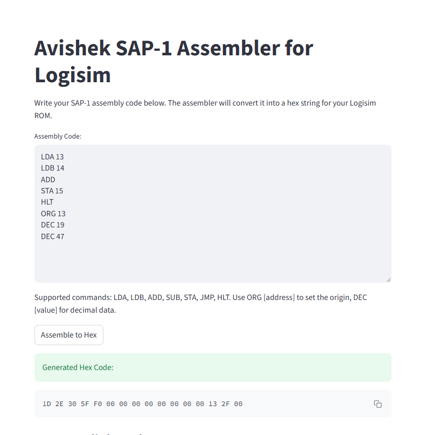

- Assembly for JMP & ADD:

```
LDA 13
LDB 14
JMP 4
ORG 4
ADD
STA 15
HLT
ORG 13
DEC 19
DEC 47
```

- Hex Code: `1D 2E 64 00 30 5F F0 00 00 00 00 00 00 13 2F 00`

---

<a id="fde"></a>

## Fetch–Decode–Execute Cycle

The CPU operates in a clock-driven cycle:

### Fetch

- **T1:** PC outputs address to MAR.
- **T2:** RAM loads instruction into IR.
- **T3:** PC increments.

### Decode

The IR opcode activates a specific instruction line via the Opcode Decoder.

### Execute

Control signals execute the instruction over T4-T6, halting at `HLT`.

---

<a id="run-auto"></a>

## Run the CPU — Auto Mode (`sap1_auto_avishek.circ`)

### 1) Initial Setup

1. Open `sap1_auto_avishek.circ` in Logisim Evolution (download from [avishek-github](https://github.com/AvishekChy/sap-1-cpu-microprocessor-logisim-evolution)).
2. Ensure `debug` is **OFF (LOW)**.
3. Keep `clk` **OFF**.
4. Pulse `pc_reset` once to set PC to `0000`.

### 2) Program the ROM

1. Right-click ROM, select **Edit Contents**.
2. Enter hex (e.g., `1D 2E 30 5F 64 F0 00 00 00 00 00 00 00 33 19 00`).
3. Save with **OK**.

### 3) Load Program to RAM (Bootloader)

1. Turn **ON** `debug` (HIGH) to enable bootloader.
2. Pulse `clk` twice per instruction/data to load ROM into SRAM.
3. Monitor MAR and Data Bus on displays.
4. Load all instructions and data.

### 4) Stop Bootloader

1. Turn **OFF** `debug` (LOW).
2. Pulse `clk` once to finalize.

### 5) Run the Program

1. Pulse `pc_reset` to start at `0000`.
2. Click `clk` repeatedly or enable continuous clock to execute.
3. Observe PC, MAR, IR, and Registers A/B on displays.
4. Follow the Fetch–Decode–Execute cycle.

### 6) Verify Result

1. After `HLT`, check RAM address `00001111` (15).
2. Expect `01001100` (76, Hex `4C`) if ADD executed.

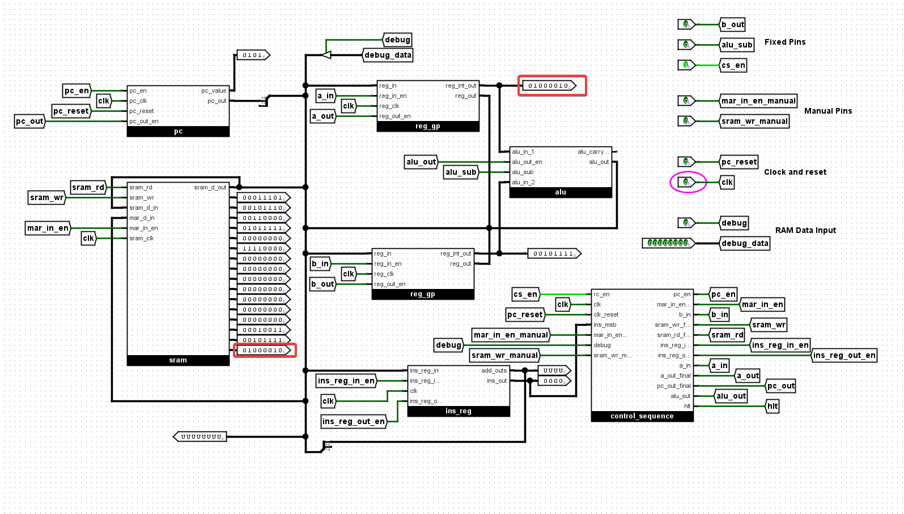

---

<a id="run-manual"></a>

## Run the CPU — Manual Mode (`sap1_manual.circ`)

### 1) Initial Setup

1. Open `sap1_manual.circ` in Logisim Evolution.
2. Ensure `debug` is **OFF (LOW)**.
3. Pulse `pc_reset` to set PC to `0000`.
4. Keep `clk` **OFF** for manual stepping.
5. Ensure `cs_en` is **ON (HIGH)**.

### 2) Program the RAM (Debug Mode)

1. Turn **ON** `debug` (HIGH) for manual control.
2. For each instruction/data:
   - Set `debug_data` to address (e.g., `00000000`).
   - Pulse `mar_in_en_manual` once.
   - Set `debug_data` to value (e.g., `00011101` for `LDA 13`).
   - Pulse `sram_wr_manual` once.
3. Load all (e.g., `1D 2E 30 5F 64 F0` and `33 19`).
4. Turn **OFF** `debug` (LOW).
5. Pulse `pc_reset` again.

### 3) Run the Program

1. Click `clk` to step through cycles.
2. Observe PC, MAR, IR, Registers A/B, and RAM changes.
3. Follow the Fetch–Decode–Execute cycle.

### 4) Verify Result

1. After `HLT`, check RAM address `00001111` (15).
2. Expect `01001100` (76, Hex `4C`).


---

<a id="roadmap"></a>

## Future Improvements

- **Expand Instruction Set:** Add `OUT`, `JZ` (jump if zero), etc.
- **Microprogrammed Control:** Use a ROM-based control unit.
- **Input/Output:** Integrate a keyboard and enhanced display.
